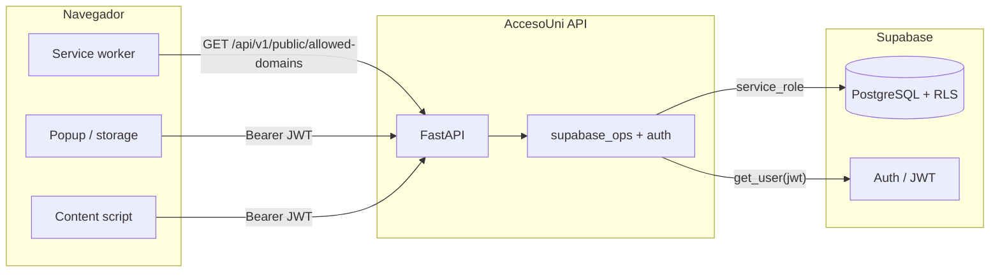

<div align="center">


# AccesoUni

**Extensión de navegador y capa de servicios para accesibilidad en portales educativos**  
Browser extension and service layer for inclusive university and school websites.

<br />

[](https://github.com/Rudeus000/AccesoUni)
[](LICENSE)
[](https://fastapi.tiangolo.com/)
[](https://developer.chrome.com/docs/extensions/mv3/intro/)

<br />

[](https://github.com/Rudeus000/AccesoUni)

</div>

---

## Vista previa

Panel de ajustes **AccesoUni** sobre un portal real (ejemplo: [ELP](https://www.elp.edu.pe/)) y botón flotante de acceso en el sitio.

| Panel de perfiles en la página | Integración discreta en el sitio |
|:-:|:-:|
|  |  |

En `docs/screenshots/` se incluye además material de referencia para la presentación del repositorio.

---

## Estructura del monorepositorio

| Ruta | Rol |
|------|-----|
| `extension/` | Extensión **Manifest V3**: popup, content script (TypeScript, empaquetado con esbuild), service worker. |
| `backend/` | API **FastAPI** (preferencias, integración con Supabase y rutas auxiliares). |
| `supabase/` | Esquema SQL y políticas RLS de referencia. |
| `dashboard/` | Panel web asociado al ecosistema (si aplica a tu despliegue). |

---

## Arquitectura y comunicación

### Visión general

AccesoUni separa tres capas: **extensión en el navegador**, **API FastAPI** y **PostgreSQL gestionado por Supabase**. La extensión no ejecuta SQL ni llama al REST de Postgres directamente para la lógica de negocio: habla con la API en JSON; quien persiste y valida contra la base es el backend, usando el cliente oficial de Supabase con la **clave `service_role`**.



### Extensión (Manifest V3)

| Pieza | Función |
|-------|---------|
| **Service worker** (`background.js`) | Resuelve la URL base del API (`ACCOUNI_BACKEND_API_BASE_URL` en código; en empaques de producción se sustituye antes de firmar la extensión). Consulta periódicamente la lista de dominios permitidos y registra dinámicamente el content script solo en patrones que coinciden con instituciones **activas**. |
| **Popup** | Aplica ajustes locales (Chrome storage) y, al guardar en servidor, envía `PUT /api/v1/preferences` con `Authorization: Bearer` y el dominio del sitio abierto para asociar la petición a una institución. |
| **Content script** | Inyectado solo en hosts autorizados. Puede enviar telemetría de auditoría con `POST /api/v1/audit/scan` autenticada igual que las preferencias. |

El token JWT que porta la extensión es el **`access_token` de sesión Supabase**. El flujo habitual es abrir `/extension-login` servido por la propia API: la página usa la **clave `anon`** en el navegador para hacer `signInWithPassword`; el usuario copia el token y lo guarda en la extensión. Esa clave `anon` no sustituye a `service_role`: solo permite el login público ante Auth; los datos tabulares siguen atravesando FastAPI.

### API FastAPI

Rutas agrupadas bajo prefijos típicos:

| Área | Ejemplos | Autenticación |
|------|----------|----------------|
| Pública | `GET /api/v1/public/allowed-domains` | Ninguna. Devuelve los dominios *apex* de instituciones con `status = active` para alinear la inyección de scripts con las reglas de negocio del backend. |
| Preferencias | `PUT /api/v1/preferences` | `HTTPBearer`: JWT válido (`get_current_user` valida contra Supabase Auth). |
| Auditoría | `POST /api/v1/audit/scan` | Mismo esquema. |
| Extensión | `GET /extension-login` | HTML sin token; incorpora anon key solo en esa página para el flujo de inicio de sesión. |

Toda escritura sensible pasa por funciones en `backend/app/supabase_ops.py`, que crean un cliente con **`SUPABASE_URL` + `SUPABASE_SERVICE_ROLE_KEY`**. Ese cliente actúa con privilegios elevados sobre Postgres respecto de un cliente *anon*: las políticas RLS del proyecto protegen accesos directos desde otros clientes; el servidor se considera de confianza.

Antes de aceptar `preferences` o `audit`, la API comprueba que el **`domain`** enviado (hostname del portal) pertenezca a una fila `institutions` **activa** y resuelva un `institution_id` coherente con la lógica `lookup_institution_for_hostname` (coincidencia del dominio base o subdominios).

### Modelo de datos (Supabase / Postgres)

Definición canónica y políticas en [`supabase/schema.sql`](supabase/schema.sql). Entidades relevantes para la extensión y la API:

| Tabla | Propósito |
|-------|-----------|
| `institutions` | Institución con `domain` único, `plan`, `status` (`pending_payment`, `active`, `suspended`) y vigencia opcional (`subscription_end`). |
| `users` | Perfil ligado al `id` del usuario en Supabase Auth y a `institution_id`. |
| `user_preferences` | Contraste, tamaño y familia de fuente, interlineado, modo de color (`user_id` único). El popup puede enviar más campos en JSON; los que no están modelados en el body Pydantic se ignoran en el endpoint de preferencias. |
| `activity_logs` | Eventos de uso (`preferences_saved`, `scan_submitted`, etc.) con `metadata` JSON. |
| `compliance_logs` | Resultados de escaneo por URL (errores, correcciones, `wcag_score`). |
| `compliance_reports` | Informes agregados (PDF en almacenamiento, puntuación). |
| `institution_admins` | Relación usuario–institución para administración. |

Las tablas tienen **RLS habilitado** para escenarios donde clientes usan claves de rol distintas. El backend con `service_role` centraliza las operaciones que hoy implementa el producto. Si el listado de instituciones activas falla al usar una clave incorrecta, el repositorio incluye scripts de apoyo como [`supabase/rls_allow_anon_read_active_institutions.sql`](supabase/rls_allow_anon_read_active_institutions.sql) según el despliegue.

### Resumen de flujos

1. **Permitir sitios**: el service worker obtiene dominios activos → construye patrones `*://dominio/*` → registra el content script; si el API no responde, puede usarse caché local con antigüedad limitada.
2. **Sincronizar preferencias**: popup → `PUT /api/v1/preferences` con JWT → validación de institución activa → `upsert` en `users` y `user_preferences` → registro en `activity_logs`.
3. **Auditoría**: content script → `POST /api/v1/audit/scan` → `compliance_logs` + `activity_logs`.

---

## Requisitos de entorno

| Componente | Versión recomendada |
|------------|---------------------|
| Node.js | 18 o superior |
| Python | 3.11 o superior |
| Supabase | Proyecto configurado cuando se utilice persistencia remota |

La extensión no incluye `dist/` en el repositorio; tras clonar hay que ejecutar el build indicado más abajo.

---

## Extensión: build y carga local

Desde `extension/`:

```bash
npm install
npm run build
```

Esto genera `dist/contentScript.js`. Para probar en **Chrome** o **Edge**: `chrome://extensions` → *Modo de desarrollador* → *Cargar descomprimida* → carpeta `extension/`.

Atajo de comandos por voz en la pestaña activa: **Alt+Mayús+V** (definido en `manifest.json`).

---

## API FastAPI

El servicio vive en `backend/`. La plantilla de variables está en [`backend/.env.example`](backend/.env.example); copie ese archivo a `.env` en el mismo directorio y complete los valores según su despliegue. Ese archivo está excluido del control de versiones.

Pasos habituales:

1. Crear un entorno virtual en `backend/` e instalar dependencias: `pip install -r requirements.txt`.
2. Configurar `backend/.env` a partir de `.env.example`.
3. Arrancar el servidor ASGI, por ejemplo: `uvicorn app.main:app --reload --host 0.0.0.0 --port 8000` con el directorio de trabajo en `backend/`.

La documentación interactiva de la API estará disponible en la ruta `/docs` de su instancia cuando [FastAPI](https://fastapi.tiangolo.com/) la tenga habilitada.

---

## Licencia

MIT — [LICENSE](LICENSE).

---

<div align="center">

Orientado a **inclusión y aprendizaje** en entornos educativos.

</div>
